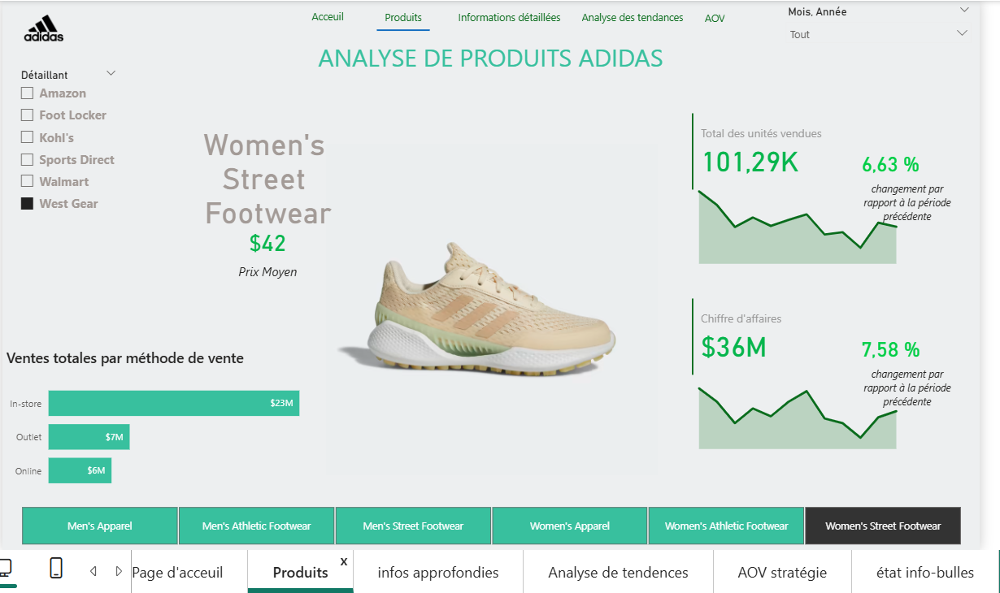

#  Adidas Sales Strategic Analysis (Power BI)

  

##  Aperçu du Projet
Ce projet est une solution décisionnelle complète (Business Intelligence) visant à analyser la performance commerciale d'Adidas aux États-Unis. Il permet aux décideurs de visualiser les KPIs critiques (Ventes, Marge Opérationnelle, Volume) et d'identifier les tendances par région, produit et canal de vente.

**Problématique :** Comment optimiser la stratégie de vente et identifier les segments les plus rentables à partir de millions de lignes de données transactionnelles ?

## Aperçu du Tableau de Bord

## Méthodologie & Stack Technique
* **Outil :** Microsoft Power BI Desktop
* **Data Engineering (ETL) :** Power Query pour le nettoyage des données (traitement des valeurs manquantes, formatage des dates).
* **Modélisation :** Conception d'un **Schéma en Étoile (Star Schema)** pour optimiser les performances.
* **Langage DAX :** Création de mesures complexes pour l'analyse temporelle (Time Intelligence) et le calcul des marges.

## 🔑 Fonctionnalités Clés
1.  **Analyse Géographique :** Carte interactive des ventes par État et Ville.
2.  **Analyse Temporelle :** Évolution du Chiffre d'Affaires (CA) et comparaison YoY (Year-over-Year).
3.  **Analyse Produit :** Classement des produits les plus performants (Top N).
4.  **KPIs Financiers :** Suivi dynamique de la Marge Opérationnelle et du Profit Total.

## Structure du Repository
* `/dashboard` : Le fichier source `.pbix` (Power BI).
* `/docs` : Le rapport détaillé du projet et les formules DAX utilisées.
* `/data` : Les jeux de données bruts (anonymisés).

## Comment visualiser
1. Téléchargez le fichier `Adidas_Sales_Analysis.pbix` dans le dossier `/dashboard`.
2. Ouvrez-le avec **Power BI Desktop**.
3. Explorez les différents onglets du rapport.

